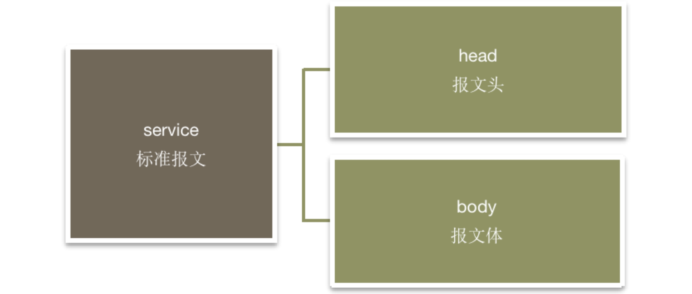

# HiveNet接口规范

规范英文名：HiveNet Interface Standards

规范中文名：HiveNet 接口规范

**HiveNet标识名：hivenet_interface_standards**

**HiveNet版本：v1.0.0**


## 制定规范目的

制定接口规范是为了标准化不同应用之间的接口访问和接口内容解析, 便于快速构建基于微服务的大型应用。


## 通讯方式及报文格式

标准通讯协议统一为 HTTP 协议，标准报文格式应为JSON格式。

若存在采用的是TCP/IP协议或其他协议的情况，以及报文为SOAP/XML等格式，则应通过开发接口适配组件或网关服务进行转换处理。


## 字符集

报文字符集统一使用UTF-8，若使用其他字符集，应通过开发接口适配组件或网关服务进行转换处理。


## 字段命名

- 字段名称：字母（a-z  A-Z）、数字（0-9）、下划线（_），长度不超过30位
- 不能以数字开头
- 区分大小写
- 多词组合时使用驼峰格式


## 标准报文设计

### 设计原则

- **规范性**：对现有系统报文头进行约定规范，统一使用口径。
- **高效性**：报文头作为服务关键数据的存储结构，需信息明确，目的清晰。
- **稳定性**：通讯报文头的设计及应用应保证系统间及微服务间的通讯的稳定
- **可扩展性**：报文头设计需满足当前及未来技术及业务发展要求，结构灵活，易于扩展
- **交易安全性**：报文信息作为各系统间的数据传输载体，报文的设计需确保系统间数据通讯的真实可靠。
- **易读性原则**：在保证报文处理高效前提下，尽可能提高报文的易读性，以利于系统测试和联调。

### 报文结构

报文总体分为两个主要部分，包括报文头，报文体，结构如下图：



#### 报文头（head）

| **英文名称** | **中文名称**     | **数据类型** | **长度** | **约束条件**                  | **是否必输** | **备注**                                                     | **码值**                                 |
| ------------ | ---------------- | ------------ | -------- | ----------------------------- | ------------ | ------------------------------------------------------------ | ---------------------------------------- |
| prdCode      | 产品码           | STRING       | 20       |                               | Y            | 调用接口时送入，用于区分此交易所对应的产品或资源信息，根据实际开发需求定义：1、具体产品编码，例如某募集理财产品的产品码;2、系统中的交易品种，例如汇出汇款、信用证等；3、操作的资源信息，例如用户信息，权限信息等。 输出报文原信息返回 |                                          |
| tranCode     | 交易码           | STRING       | 20       |                               | Y            | 调用接口时送入，用于区分交易的类型，详见《交易码规范》； 输出报文原信息返回。注：产品码+交易码唯一确定一个交易操作类型 |                                          |
| originSysId  | 源系统标识       | STRING       | 9,9      |                               | Y            | 交易发起源头系统标识，格式为“5位系统标识-3位模块标识（如不需要可为000）”，按实际定义的产品系统标识填写，该标识应在接口传递中不改变。例如："WEB01-M01" 或 “WEB01-000”（无模块名的情况）。输出报文原信息返回 |                                          |
| sysId        | 请求系统标识     | STRING       | 9,9      |                               | Y            | 请求方系统标识，格式为“5位系统标识-3位模块标识（如不需要可为000）”，按实际定义的产品系统标识填写 |                                          |
| infType      | 接口类型         | STRING       | 2,2      |                               | Y            | 接口类型，指明是请求还是响应                                 | 01-请求报文02-响应报文                   |
| tranMode     | 交易模式         | STRING       | 10       |                               | N            | 指定报文为同步还是异步处理。输出报文原信息返回               | ONLINE－联机处理（默认） ASYNC－异步处理 |
| userId       | 用户号（客户号） | STRING       | 20       | 涉及客户信息时必填            | N            | 交易涉及的用户（客户）号。输出报文原信息返回                 |                                          |
| token        | 用户会话token    | STRING       | 512      | 需通过token验证用户权限时使用 | N            | 用户登录会话权限验证token                                    |                                          |
| globSeqNum   | 统一流水号       | STRING       | 28,28    |                               | Y            | 统一流水号：渠道层系统客户或柜员发起交易的最原始流水号，报文所经过的业务系统从服务消费方报文头中获取，在整个交易流转中保持不变，具体见《接口交互流水号规范。输出报文原信息返回 |                                          |
| sysSeqNum    | 系统流水号       | STRING       | 30,30    |                               | Y            | 系统流水号：由处理系统标识当前系统中对应统一流水号所指交易，具体见《接口交互流水号规范》。输出报文原信息返回 |                                          |
| infSeqNum    | 接口流水号       | STRING       | 39,39    |                               | Y            | 接口流水号：标识发起接口调用的流水号，具体见《接口交互流水号规范》。输出报文原信息返回 |                                          |
| branchId     | 交易发起机构标识 | STRING       | 12       |                               | N            | 交易发起机构标识                                             |                                          |
| tranDate     | 交易日期         | STRING       | 8,8      |                               | N            | 交易发起日期字符串，YYYYMMDD，无掩码                         |                                          |
| tranTime     | 交易时间         | STRING       | 9,9      |                               | N            | 交易发起时间字符串，HHMMSSNNN，无掩码                        |                                          |
| batchId      | 批次标识         | STRING       | 40       |                               | N            | 用于请求方传入区分不同对账场次的批次标识，响应方在对账时根据该标识返回指定批次的对账数据 |                                          |
| errCode      | 错误码           | STRING       | 5,5      | 响应报文必填                  | N            | 返回错误码，见《接口交互错误码规范》                         |                                          |
| errMsg       | 错误信息         | STRING       | 400      | 响应报文必填                  | N            | 返回错误描述                                                 |                                          |
| errModule    | 错误模块         | STRING       | 8,8      |                               | N            | 返回错误对应系统标识，格式为“5位系统标识+3位模块标识（如不需要可为000）”。见《接口交互错误码规范》 |                                          |
| backDate     | 后台交易日期     | STRING       | 8,8      | 响应报文选填                  | N            | 后台交易日期字符串，YYYYMMDD，无掩码                         |                                          |
| backTime     | 后台交易时间     | STRING       | 9,9      | 响应报文选填                  | N            | 后台交易时间字符串，HHMMSSNNN，无掩码                        |                                          |
| backSeqNum   | 后台流水号       | STRING       | 40       | 响应报文选填                  | N            | 后方服务系统返回的交易流水，用于唯一标识该笔请求的受理。     |                                          |
| ver          | 报文版本         | STRING       | 8        |                               | N            | 报文版本，默认填1.0.0                                        |                                          |

**注：**

**1、对于webservices或restful api的接口，接口uri应遵循以下格式要求： “服务系统标识/产品码/交易码”（针对接口需按交易码区分的情况），或“服务系统标识/产品码”（针对接口无需按交易码区分的情况）；**

**2、对于服务发现机制，所发布的服务名与uri格式要求相对应，格式为：“服务系统标识-产品码-交易码”或“服务系统标识-产品码”。**


#### 报文体（body）

报文体，可选，根据实际应用需求使用。其中有以下几项为推荐字段（按需使用）:

| **英文名称** | **中文名称** | **数据类型** | **长度** | **约束条件** | **是否必输** | **备注**                                                     | **码值** |
| ------------ | ------------ | ------------ | -------- | ------------ | ------------ | ------------------------------------------------------------ | -------- |
| pageNum      | 当前页码     | INTEGER      | 1,11     |              | N            | 分页时使用，默认值为1请求报文时：指定当前需获取的页码响应报文时：标识返回的报文的页面 |          |
| pageSize     | 每页记录条数 | INTEGER      | 1,11     |              | N            | 分页时使用，默认值为10请求报文时：指定分页的每页大小响应报文时：返回数据的分页大小 |          |
| totalNum     | 总记录数     | INTEGER      | 1,11     |              | N            | 分页时使用请求报文无需传入响应报文时：返回数据的总记录数     |          |
| cacheId      | 缓存ID       | STRING       | 20       |              | N            | 请求数据的缓存ID请求报文：如果传入代表使用上一次查询的缓存数据，应按第一次查询获取到的缓存ID传入响应报文：如果当前查询有缓存机制（即将查询结果存到临时表，加快下次查询的速度），则返回可识别的缓存ID |          |


#### 报文示例

```
{
  "head": {
    "prdCode": "userInfo",
    "tranCode": "query",
    ...
	},
  "body": {
    ...
  }
}
```


## 交易码规范

交易码最大长度为20位，建议统一管理，接口支持不同的交易场景时，接口提供方需提供多个交易码，接口调用方根据不同的场景送入对应的交易码。

针对产品码传入的类型不同，交易码区分为资源操作类、交易处理类、产品处理类这3大类。

**资源操作类交易码示例:**

| **交易码** | **交易码描述** | **备注**                                       |
| ---------- | -------------- | ---------------------------------------------- |
| query      | 通用资源查询   | 查询产品码定义的资源信息，例如:userInfo/query  |
| update     | 通用资源更新   | 更新产品码定义的资源信息，例如:userInfo/update |
| delete     | 通用资源删除   | 删除产品码定义的资源信息，例如:user/delete     |
| login      | 登录           | 例如：user/login                               |
| logout     | 注销登录       | 例如：user/logout                              |

**交易处理类交易码示例:**

| **交易码** | **交易码描述** | **备注**              |
| ---------- | -------------- | --------------------- |
| cacheSave  | 交易临时保存   | 例如:credit/cacheSave |
| save       | 交易保存       | 例如:credit/save      |
| submit     | 交易提交       |                       |
| goBack     | 交易打回       |                       |

**产品处理类交易码示例：**

| **交易码**       | **交易码描述** | **备注** |
| ---------------- | -------------- | -------- |
| createAgreement  | 建立协议       |          |
| releaseAgreement | 解除协议       |          |
| changeAgreement  | 修改协议       |          |
| createContract   | 创建合同       |          |
| releaseContract  | 解除合同       |          |
| changeContract   | 修改合同       |          |
| subscribing      | 认购           |          |
| purchasing       | 申购           |          |
| buy              | 购买           |          |
| redeming         | 赎回           |          |